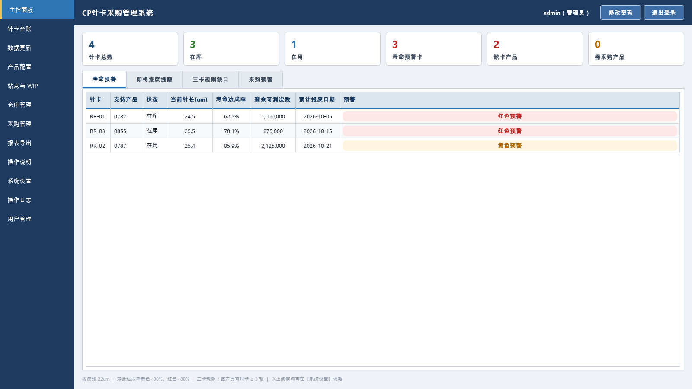
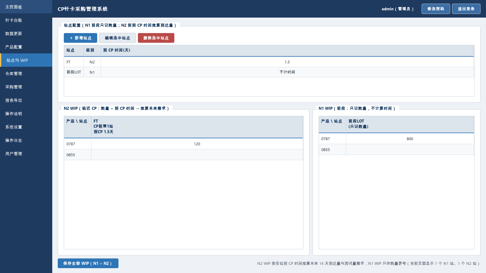
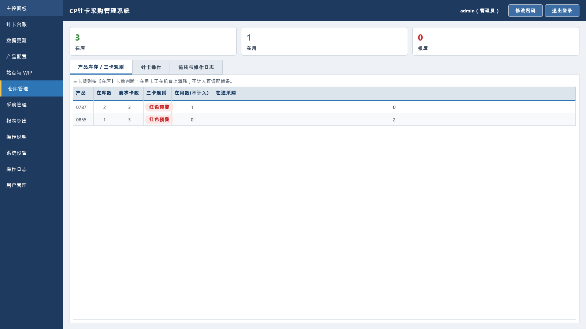
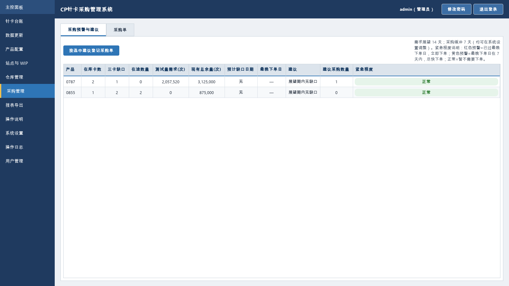

# CP针卡采购管理系统

基于 **PySide6 + SQLite** 的半导体 CP 测试针卡（Probe Card）全生命周期管理桌面应用：针卡台账、磨损数据记录、寿命预测、三卡规则、WIP 需求预估、采购闭环与仓库流转，专为 **5~15 人团队在局域网共享盘上多人共用** 的场景设计，PyInstaller 打包为免安装单文件 exe。

| 主控面板 | 站点与 WIP |
| --- | --- |
|  |  |
| **仓库管理（三卡规则）** | **采购管理（紧急程度）** |
|  |  |

## 功能特性

- **针卡台账**：针卡与产品多对多关联；入库/编辑/删除（删除仅管理员）；磨损曲线详情（pyqtgraph 绘制实测点、拟合线、报废线）。
- **数据更新**：录入"累计测试量 + 当前针长"，带倒挂提醒、单位核对、到线提醒等软警告；支持删除误录记录。
- **寿命预测**：单卡线性回归外推报废点；数据点不足时自动借用**同产品全部针卡（含已报废卡）**的类型磨损曲线；寿命达成率 = 预测报废测试量 ÷ 额定寿命，按阈值分级红/黄预警；按最近消耗速度外推预计报废日期并提前提醒。
- **三卡规则**：每个产品保有 ≥3 张**在库**卡（在用卡不计入储备），缺口在主控面板与仓库页红色预警。
- **站点与 WIP**：站点分 N1（前段，只记数量）/ N2（临近 CP，记数量 + 到 CP 天数）两级；N2 按"CP前第N站"推算未来 14 天逐日到达量；单元格改动即存。
- **需求预估**：到达片数 × 片耗 → 测试量需求 ÷ 单卡平均剩余寿命 → 折算需求张数，叠加三卡缺口。
- **采购闭环**：预测缺口日 → 倒扣提前期与缓冲得到最晚下单日 → 紧急程度分级（红色=已过最晚下单日 / 黄色=7 天内 / 正常）；建议数量自动扣减在途采购；采购单登记、到货、取消、删除全流程。
- **仓库管理**：在库 → 在用 → 报废三状态流转（服务层严格校验），流转留痕可追溯；报废卡数据仍参与类型曲线拟合。
- **报表导出/导入**：四种 Excel 报表（针卡台账/寿命预测/需求预估/采购建议与采购单）；导入自动识别此前导出的格式，自动建缺失产品、跳过已存在针卡、幂等补数据点、坏行隔离。
- **账号与权限**：管理员/工程师角色；激活码自助注册；连续错 5 次锁定 5 分钟；管理员可查看/重置他人密码、启停删账号；【用户管理】模块固定在导航底部，凭模块密码进入。
- **审计与运维**：全操作审计日志；每日自动备份数据库并按保留期清理；全部业务参数在【系统设置】页可改，代码只存出厂默认值。

## 架构

分层单向依赖，SQL 只出现在数据层，业务规则只在服务层，界面层零 SQL：

```
main.py                 入口：异常钩子 / Windows AppUserModelID（任务栏图标）/ QSS / 备份 / 登录
app/
  constants.py          枚举 + 出厂默认配置 + 固定常量（激活码、模块密码）
  paths.py / app_config.py   exe 同目录 config.ini，仅存数据库路径
  database/             建表与轻量迁移；短事务 + busy_timeout(15s) + 指数退避重试(5次)；每日备份
  repositories/         全部 SQL：users / products / cards / planning / purchases / settings / audit
  services/             业务规则：auth / card / prediction / demand / purchase / warehouse / report
  services/app_context.py    组合根：装配全部依赖，界面层唯一入口
  ui/                   styles(QSS) / main_window / login_dialog / pages / widgets
  utils/                Excel 导出（含公式注入防护）、时间工具
tools/make_icon.py      重新生成应用图标（小仓库+小芯片线稿）
tests/                  57 个自动化测试（业务/对抗/并发/导入导出/删除保护/GUI 冒烟）
```

**共享盘 SQLite 并发设计**：所有写操作走"短事务 + `busy_timeout` 15s + 锁冲突指数退避随机抖动重试（最多 5 次）"；刻意不启用 WAL（SMB 网盘上 WAL 依赖的共享内存不可靠）。三客户端并发写已由并发测试覆盖（不同产品 ×25、同卡并发、混合操作全部成功）。

**低配机性能设计**（针对十年以上机龄的老电脑优化）：每线程持久连接（消除共享盘上每次查询的建连往返）；寿命预测/需求/采购建议按数据版本缓存，界面刷新从"数百卡 × 数千次查询"降为毫秒级（300 卡 × 9000 数据点实测：冷启动全量预测约 0.3s，日常刷新约 0.06s，单条数据写入后刷新约 0.4s）；全量预测批量装载（4 条 SQL 取回全部输入，消除 N+1）；表格填充期间关闭逐格重排、填完一次性列宽自适应；搜索 250ms 防抖。缓存通过本进程写版本号 + SQLite `PRAGMA data_version` 双信号失效，多人共享场景不会读到过期结果。

## 快速开始

```bash
pip install -r requirements.txt      # PySide6 / numpy / pyqtgraph / openpyxl
python main.py                       # 开发态运行
python -m pytest tests -q            # 跑全部 57 个测试
```

打包单文件 exe（Windows）：

```bash
python -m PyInstaller --noconfirm --clean --onefile --windowed --name probe_card_manager ^
  --icon assets/app.ico --add-data "assets;assets" ^
  --exclude-module pytest --exclude-module pytest_timeout --exclude-module _pytest main.py
```

## 共享盘部署

1. 把 `probe_card_manager.exe` 放到局域网 SMB 共享目录（如 `\\文件服务器\共享\针卡管理\`），人人双击即用；
2. 若同事本地拷贝 exe 运行，编辑 exe 同目录 `config.ini`，让所有人指向**同一个**数据库文件：
   ```ini
   [database]
   db_path = \\文件服务器\共享\针卡管理\data\probe_card.db
   ```
3. ⚠️ 必须是 SMB 文件共享，**不要用 OneDrive/坚果云等同步盘**（会损坏 SQLite 数据库）；
4. 每天首次打开自动备份到 `data/backups/`，默认保留 30 天。

## 默认账号与安全说明（公开仓库请先改这里）

仓库公开版中以下值均为**占位值**，部署前请替换为你们自己的固定值：

- 内置账号：`app/repositories/users_repo.py` 的 `BUILTIN_ACCOUNTS`（演示：`admin / Admin@12345`，首次登录后软件会主动提醒修改）；
- 注册激活码与用户管理模块密码：`app/constants.py` 的 `ACTIVATION_CODE`、`USER_MODULE_PASSWORD`。

其余安全设计：密码 PBKDF2-SHA256（10 万次迭代+随机盐）校验登录；防暴力破解锁定；服务层强制鉴权（绕过界面直调业务层同样被拒并记审计）；Excel 导出防公式注入；界面富文本 HTML 转义；全部敏感操作写审计日志。

> **已知取舍**：为支持管理员"查看密码"功能，数据库中另存有可逆混淆的密码副本（`password_recover`）。请勿把 `.db` 文件或备份发给不可信的人；不需要此功能时可移除相关代码。

## License

[MIT](LICENSE)
